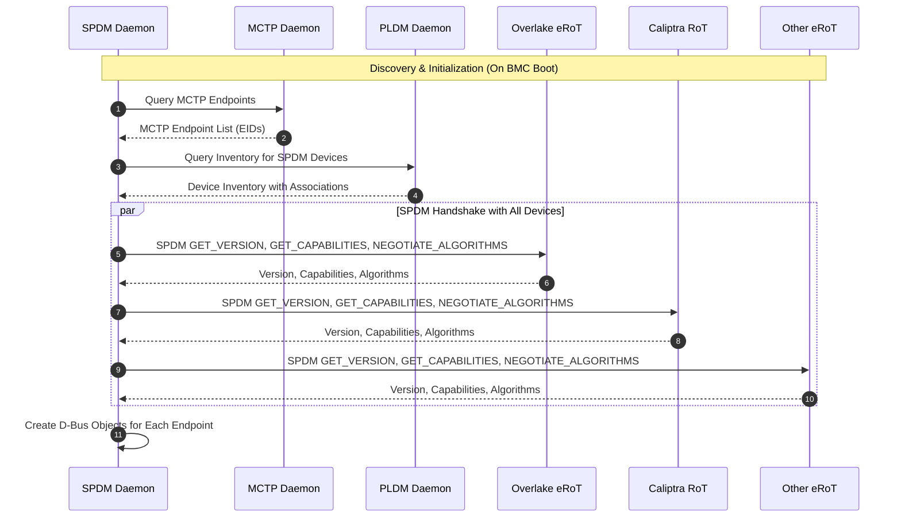
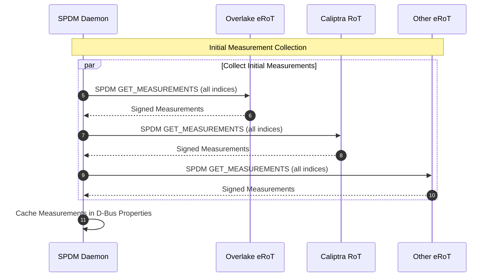
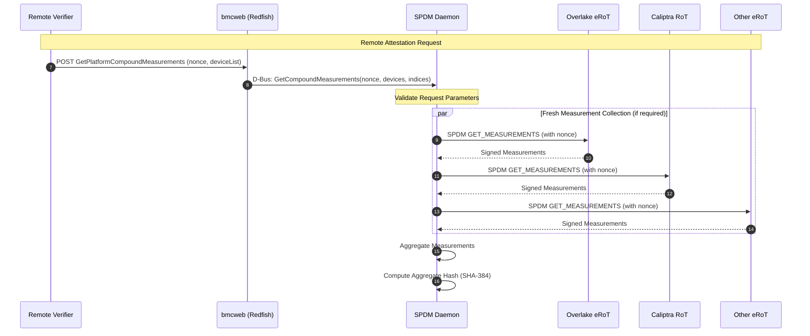
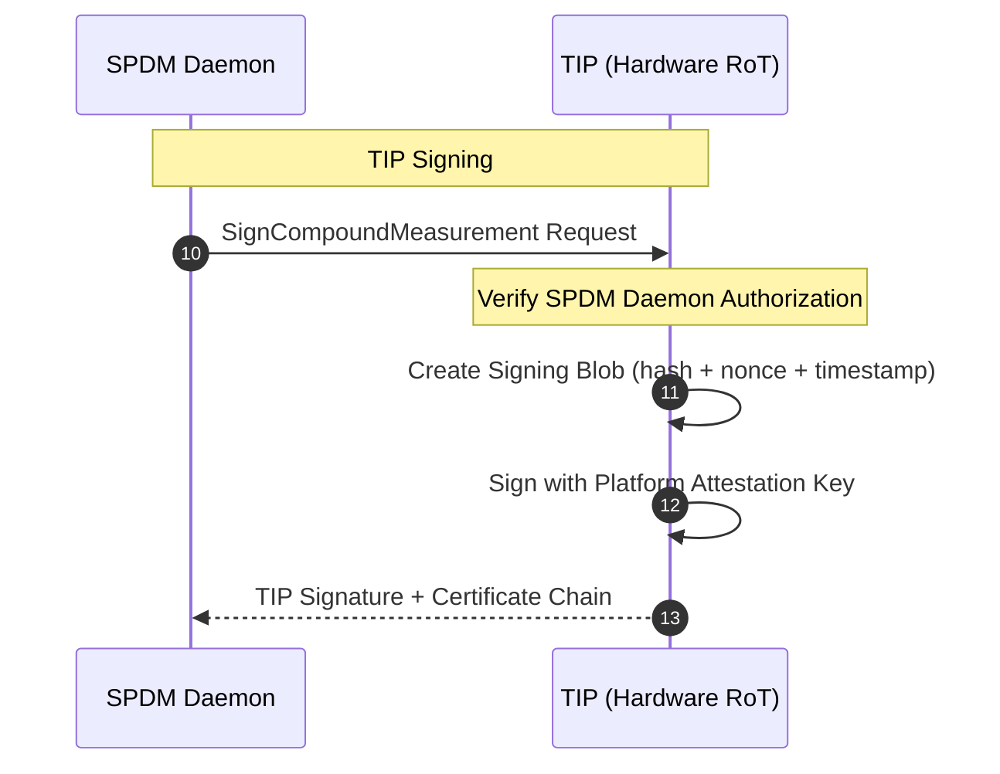
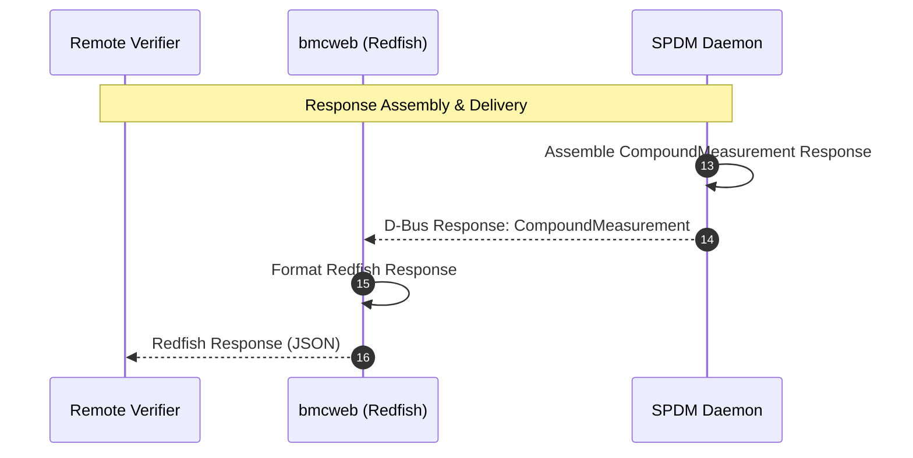
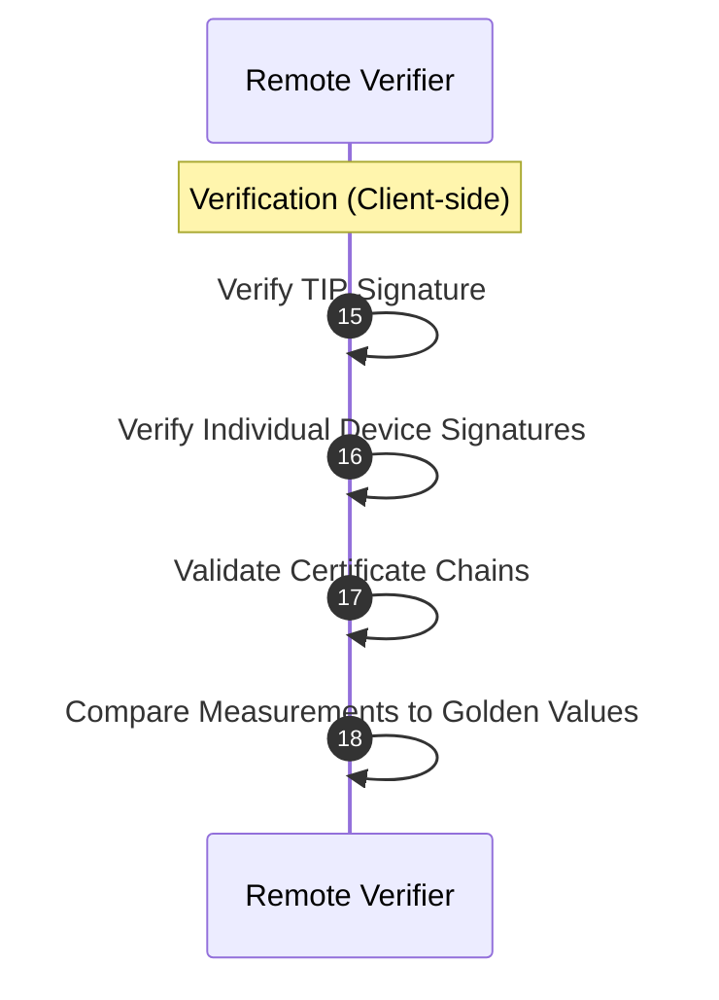
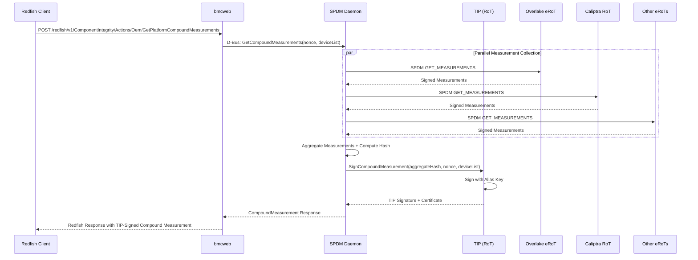

# Enabling Platform Attestation via Redfish on Hydra BMC

# 1. Overview

This document proposes a platform attestation architecture via Redfish with Hydra BMC as the Platform RoT (PA-RoT). The proposed solution enables secure, standards-based attestation of device firmware and configuration by leveraging:

- **BMC as Platform RoT**: Central trust anchor collecting measurements from all end devices via the SPDM daemon
- **TIP (Trusted Integrated Processor) Signing**: Compound measurements cryptographically signed by the hardware RoT to prove report authenticity to remote attestation services
- **DMTF SPDM Protocol**: Standards-based secure communication for device authentication and measurement collection
- **Extended Redfish APIs**: Custom actions supporting compound measurement operations and TIP signing workflows

# 2. High-Level Architecture

## Components

- **OpenBMC Normal World**

  - **SPDM Daemon**: Central service managing SPDM protocol exchanges, device discovery, measurement collection, compound measurement aggregation, and invoke TIP signing. Communicates with TIP hardware via MCTP mailbox for signing operations.
  - **Redfish Service (bmcweb)**: Translates Redfish API requests into SPDM operations, exposes attestation data to clients
  - **MCTP Daemon**: Handles transport of SPDM messages over PCIe, I2C, I3C, USB, SPI etc.
  - **PLDM Daemon**: Maintains inventory and associations for SPDM-capable devices.
  - **Logging Daemon**: Used to log diagnostic information related to the operations of the SPDM Daemon.

- **Backend Security Processor**

    - **TIP (Trusted Integrated Processor)**: Hardware RoT providing cryptographic signing for compound measurements, holds device identity endorsed by HKMS.

## Platform RoT Responsibilities

| Responsibility | Description |
|----------------|-------------|
| **Device Discovery** | Discover all SPDM-capable endpoints via MCTP and PLDM |
| **Measurement Collection** | Collect signed measurements from each endpoint via SPDM |
| **Measurement Aggregation** | Aggregate individual measurements into compound measurements |
| **TIP Signing** | Request TIP to sign compound measurements for platform attestation |
| **Certificate Management** | Manage endpoint certificates and trust chains |
| **Attestation Response** | Provide complete attestation evidence to verifiers via Redfish |

## Architecture Diagram


# 3. End-to-End Data Flow

## Phase 1: Discovery & Initialization

On BMC boot, the SPDM Daemon discovers all SPDM-capable endpoints and establishes secure communication channels.

1. SPDM Daemon queries MCTP daemon for available endpoints
2. PLDM daemon provides inventory information and associations
3. SPDM Daemon performs handshake with each SPDM-capable device
4. D-Bus objects are created for each discovered endpoint



## Phase 2: Initial Measurement Collection

After discovery, the SPDM Daemon collects initial measurements from all devices and caches them for quick access.

5. SPDM Daemon collects measurements from all devices
6. Measurements are cached in D-Bus properties for quick access



## Phase 3: Remote Attestation Request

When a remote verifier requests attestation, the request flows through bmcweb to the SPDM Daemon, which collects fresh measurements.

7. Verifier sends attestation request via Redfish API
8. bmcweb translates request to D-Bus call
9. SPDM Daemon collects fresh measurements with provided nonce



## Phase 4: TIP Signing

The SPDM Daemon requests the TIP (Hardware RoT) to sign the compound measurement, providing platform-level attestation.

10. SPDM Daemon aggregates measurements and computes hash
11. TIP signs the compound measurement with platform key
12. TIP returns signature and certificate chain



## Phase 5: Response Assembly & Delivery

The SPDM Daemon assembles the complete response and bmcweb formats it as a Redfish response for the verifier.

13. SPDM Daemon assembles complete response
14. bmcweb formats and returns Redfish response



## Phase 6: Verification (Client-side)

The remote verifier validates all cryptographic signatures and compares measurements against known-good values.

15. Verifier validates all signatures and certificates
16. Measurements compared against known-good values



---

# 4. Compound Measurements with TIP Signing

## Motivation

Modern platforms require attestation of multiple devices and a holistic view of platform integrity. Individual device measurements are insufficient for:

- Verifying the overall platform security posture
- Detecting coordinated attacks across multiple components
- Providing a single attestation evidence for platform trust decisions

## TIP's Role

The TIP is the hardware RoT that:

- **Holds Cryptographic Device Identity**: Contains unique device identity keys, endorsed by HKMS
- **Performs Cryptographic Signing**: Signs compound measurements with platform-level attestation keys
- **Maintains Secure Storage**: Protects private keys and critical security data
- **Provides Freshness**: Includes nonce and timestamp in signatures

## Compound Measurement Flow



## Compound Measurement Structure (TBD)

```json
{
    "CompoundMeasurement": {
        "Nonce": "base64-encoded-nonce",
        "Timestamp": "2025-01-14T12:00:00Z",
        "Devices": [
            {
                "DeviceId": "Overlake_0",
                "EndpointPath": "/xyz/openbmc_project/SPDM/Overlake_0",
                "MeasurementHash": "sha384-hash",
                "Signature": "device-signature",
                "Certificate": "device-certificate-chain"
            },
            {
                "DeviceId": "Caliptra_0",
                "EndpointPath": "/xyz/openbmc_project/SPDM/Caliptra_0",
                "MeasurementHash": "sha384-hash",
                "Signature": "device-signature",
                "Certificate": "device-certificate-chain"
            }
        ],
        "AggregateHash": "sha384-aggregate-hash",
        "HashAlgorithm": "TPM_ALG_SHA384",
        "TIPSignature": {
            "SignatureType": "ECDSA_P384",
            "Signature": "base64-encoded-tip-signature",
            "Certificate": "tip-certificate-chain",
            "SigningKeyId": "platform-attestation-key-001"
        }
    }
}
```

---

# 5. Redfish API Extension

## Extended ComponentIntegrity Schema

The existing Redfish ComponentIntegrity schema is extended with OEM actions for Platform RoT attestation.

### New OEM Actions

#### 1. GetPlatformCompoundMeasurements

Retrieves compound measurements from all specified devices, signed by the TIP.

**URI**: `POST /redfish/v1/ComponentIntegrity/Actions/Oem/Microsoft.GetPlatformCompoundMeasurements`

**Request Body**:
```json
{
    "Nonce": "base64-encoded-32-byte-nonce",
    "DeviceFilter": ["Overlake_0", "Caliptra_0", "NIC_0"],
    "MeasurementIndices": [1, 2, 3, 255],
    "IncludeCertificates": true
}
```

**Response**:
```json
{
    "@odata.type": "#Microsoft.PlatformCompoundMeasurement.v1_0_0.CompoundMeasurementResponse",
    "Status": "Success",
    "CompoundMeasurement": {
        "Nonce": "base64-encoded-nonce",
        "Timestamp": "2025-01-14T12:00:00Z",
        "Devices": [...],
        "AggregateHash": "sha384-aggregate-hash",
        "TIPSignature": {...}
    }
}
```

#### 2. GetTIPCertificate

Retrieves the TIP (Platform RoT) certificate chain for verification.

**URI**: `GET /redfish/v1/ComponentIntegrity/TIPCertificate`

**Response**:
```json
{
    "@odata.type": "#Microsoft.TIPCertificate.v1_0_0.TIPCertificate",
    "CertificateChain": "PEM-encoded-certificate-chain",
    "KeyType": "ECDSA_P384",
    "ValidFrom": "2024-01-01T00:00:00Z",
    "ValidTo": "2034-01-01T00:00:00Z",
    "Issuer": "Microsoft Platform CA"
}
```

#### 3. RefreshPlatformMeasurements

Triggers a fresh measurement collection from all or specified devices.

**URI**: `POST /redfish/v1/ComponentIntegrity/Actions/Oem/Microsoft.RefreshPlatformMeasurements`

**Request Body**:
```json
{
    "DeviceFilter": ["Overlake_0", "Caliptra_0"],
    "ForceRefresh": true
}
```

**Response**:
```json
{
    "TaskId": "/redfish/v1/TaskService/Tasks/12345",
    "TaskState": "Running",
    "Message": "Measurement refresh initiated for 2 devices"
}
```

### Resource URIs

| Resource | URI | Method | Description |
|----------|-----|--------|-------------|
| Component Integrity Collection | `/redfish/v1/ComponentIntegrity` | GET | List all component integrity resources |
| Individual Component | `/redfish/v1/ComponentIntegrity/{id}` | GET | Get specific component measurements |
| Platform Compound Measurements | `/redfish/v1/ComponentIntegrity/Actions/Oem/Microsoft.GetPlatformCompoundMeasurements` | POST | Get TIP-signed compound measurements |
| TIP Certificate | `/redfish/v1/ComponentIntegrity/TIPCertificate` | GET | Get TIP certificate chain |
| Refresh Measurements | `/redfish/v1/ComponentIntegrity/Actions/Oem/Microsoft.RefreshPlatformMeasurements` | POST | Trigger measurement refresh |

---

# 6. D-Bus Interface Design

## Object Tree

```
/xyz
└── /xyz/openbmc_project
    └── /xyz/openbmc_project/SPDM
        ├── /xyz/openbmc_project/SPDM/Overlake_0
        ├── /xyz/openbmc_project/SPDM/Caliptra_0
        ├── /xyz/openbmc_project/SPDM/FPGA_0
        └── /xyz/openbmc_project/SPDM/CompoundMeasurement
```

## New D-Bus Interfaces

### xyz.openbmc_project.SPDM.CompoundMeasurement

Interface for compound measurement operations. The SPDM daemon internally handles TIP communication via MCTP mailbox for signing operations.

| Method | Arguments | Returns | Description |
|--------|-----------|---------|-------------|
| `GetCompoundMeasurements` | `nonce: ay`, `devices: as`, `indices: au` | `CompoundMeasurementResult` | Get TIP-signed compound measurements |
| `RefreshAllMeasurements` | `force: b` | `TaskPath: o` | Refresh measurements from all devices |
| `GetTIPCertificateChain` | - | `Certificate: s` | Get TIP certificate chain (PEM) |

| Property | Type | Description |
|----------|------|-------------|
| `LastCompoundMeasurement` | `a{sv}` | Last compound measurement result |
| `SupportedDevices` | `as` | List of available device endpoints |
| `Status` | `s` | Current operational status |
| `TIPStatus` | `s` | TIP communication status (Online/Offline/Error) |

## D-Bus Example Usage

```bash
# Get compound measurements for all devices (includes TIP signing)
busctl call xyz.openbmc_project.SPDM \
    /xyz/openbmc_project/SPDM/CompoundMeasurement \
    xyz.openbmc_project.SPDM.CompoundMeasurement \
    GetCompoundMeasurements ayasau \
    32 <nonce-bytes> \
    2 "Overlake_0" "Caliptra_0" \
    1 255

# Get TIP certificate chain
busctl call xyz.openbmc_project.SPDM \
    /xyz/openbmc_project/SPDM/CompoundMeasurement \
    xyz.openbmc_project.SPDM.CompoundMeasurement \
    GetTIPCertificateChain

# Check TIP communication status
busctl get-property xyz.openbmc_project.SPDM \
    /xyz/openbmc_project/SPDM/CompoundMeasurement \
    xyz.openbmc_project.SPDM.CompoundMeasurement \
    TIPStatus
```

---

# 7. Security Considerations

## Cryptographic Requirements

| Aspect | Requirement |
|--------|-------------|
| **Hash Algorithm** | SHA-384 (TPM_ALG_SHA384) |
| **Signing Algorithm** | ECDSA with P-384 curve |
| **Nonce Size** | 32 bytes (256 bits) |
| **Certificate Format** | X.509 v3, DER or PEM encoded |
| **Key Storage** | TIP secure storage (hardware-protected) |

## Security Properties

1. **Authenticity**: All measurements are cryptographically signed
2. **Integrity**: Aggregate hash prevents tampering with individual measurements
3. **Freshness**: Nonce and timestamp ensure replay protection
4. **Non-repudiation**: TIP signature provides platform-level attestation
5. **Confidentiality**: SPDM secure sessions for measurement transport (optional)

## Threat Mitigations

| Threat | Mitigation |
|--------|------------|
| Measurement Tampering | Cryptographic signatures from each device and TIP |
| Replay Attack | Fresh nonce provided by verifier, timestamp in signature |
| Man-in-the-Middle | SPDM authenticated sessions, certificate validation |
| Unauthorized Access | D-Bus access control, Redfish authentication |
| Key Compromise | Hardware-protected keys in TIP, certificate revocation |

---

# 8. Development Work Planning

## Overview

The development is organized into two stages:
1. **Stage 1**: Leverage NVIDIA's SPDM daemon to enable basic attestation in OpenBMC
2. **Stage 2**: Build customized Platform RoT attestation with TIP signing flow

## Stage 1: NVIDIA SPDM Daemon Integration

**Goal**: Enable basic SPDM attestation using NVIDIA's existing SPDM daemon

### Tasks

| # | Task | Dependencies | Deliverables |
|---|------|--------------|--------------|
| 1.1 | SPDM Daemon Integration | - | SPDM daemon running on target BMC |
| 1.2 | MCTP Transport Configuration | 1.1 | MCTP communication with end devices |
| 1.3 | PLDM Inventory Integration | 1.1, 1.2 | Device discovery via PLDM |
| 1.4 | bmcweb ComponentIntegrity Support | 1.1 | Redfish ComponentIntegrity API |
| 1.5 | End Device Testing | 1.1-1.4 | Verified measurements from Overlake |
| 1.6 | Documentation & Testing | 1.1-1.5 | Test cases, API documentation |

## Stage 2: Platform RoT Attestation with TIP Signing

**Goal**: Implement customized compound measurement flow with TIP signing


### Tasks (WIP)


# 9. References

- [NVIDIA Redfish SPDM Attestation Design](https://github.com/NVIDIA/nvbmc-docs/blob/develop/nvidia/Attestation/spdmd.md)
- [DMTF SPDM Specification (DSP0274)](https://www.dmtf.org/sites/default/files/standards/documents/DSP0274_1.1.1.pdf)
- [DMTF SPDM over MCTP Binding (DSP0275)](https://www.dmtf.org/sites/default/files/standards/documents/DSP0275_1.0.0.pdf)
- [Redfish ComponentIntegrity Schema](https://redfish.dmtf.org/schemas/v1/ComponentIntegrity.v1_2_0.json)
- [OpenBMC D-Bus Interface Guidelines](https://github.com/openbmc/docs/blob/master/architecture/interface-overview.md)
