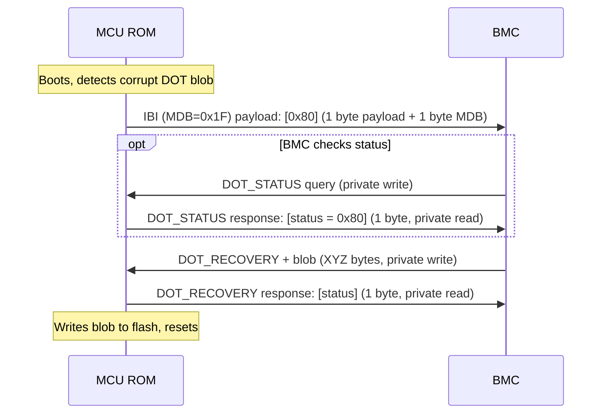

# DOT I3C Recovery Protocol

This document specifies the I3C-based transport protocol used for Device Ownership Transfer (DOT) recovery in the MCU ROM or runtime. For the overall DOT specification, see [Device Ownership Transfer](dot.md).

## Overview

When the MCU ROM detects a corrupted or missing DOT blob while in ODD state (Locked or Disabled), the device enters DOT recovery mode. In this mode, the ROM or early RT waits for an external recovery agent to send a backup DOT blob over I3C.

### Recovery Trigger Conditions

DOT I3C recovery is entered when **any** of the following conditions are met:

1. **Empty/erased DOT blob with DOT enabled**: The DOT blob in flash is all zeros or all 0xFF, but the `DOT_INITIALIZED` fuse is set, indicating the device expects a valid DOT blob.
2. **Corrupt DOT blob in locked state**: The DOT blob exists in flash but fails HMAC authentication using the DOT_EFFECTIVE_KEY, and the DOT_FUSE_ARRAY is in ODD state (locked).
3. **Both A/B copies invalid**: If the device stores redundant DOT blob copies (A/B partitions) and both copies are missing or fail authentication, recovery is triggered.

### `DOT_RECOVERY` Flow



## I3C Transport Details

### MDB (Mandatory Data Byte)

| MDB  | Description |
|------|-------------|
| 0x1F | DOT recovery IBI with inline payload data |

MDB 0x1F is a vendor-defined value. The IBI carries inline payload data (status byte).

### Framing

Commands and responses are carried over I3C private writes and private reads respectively.

#### BMC → MCU (Private Write)

```
Byte 0:  Command ID (u8)
Byte 1:  Length (u8)
Byte 2:  Sequence number
Byte 3:  Total sequences
Bytes 4+:  Payload (variable length, determined by length)
```

Since messages can in general be more than the MTU for I3C, a simple sequencing system is used.

The sequence number is a 1-up counter, and the third byte indicates the total number of sequences.

#### MCU → BMC (Private Read)

All MCU responses are sent as a sequence private reads. The lengths will always be known in advance by the recovery agent, as only simple responses are used by this protocol.

**DOT_RECOVERY_RESPONSE** (success response to DOT_RECOVERY):

```
Byte 0: Status code (u8) = 0x00
```

### Commands

| Cmd ID | Name | Payload | Description |
|--------|------|---------|-------------|
| 0x01 | DOT_STATUS | (none) | BMC queries current DOT recovery status |
| 0x02 | DOT_RECOVERY | ... | BMC sends a backup DOT blob for recovery |
| 0x03 | DOT_UNLOCK_CHALLENGE | ... | BMC sends starts override sequence |
| 0x04 | DOT_OVERRIDE | ... | BMC sends continues override sequence |

#### DOT_STATUS (0x01)

...

#### DOT_RECOVERY (0x02)

...

#### DOT_UNLOCK_CHALLENGE (0x03)

...

#### DOT_OVERRIDE (0x04)

...
