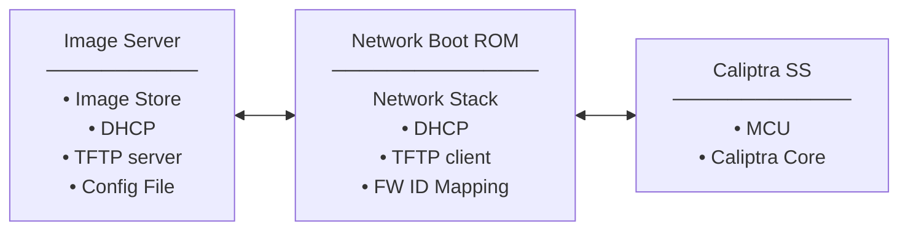
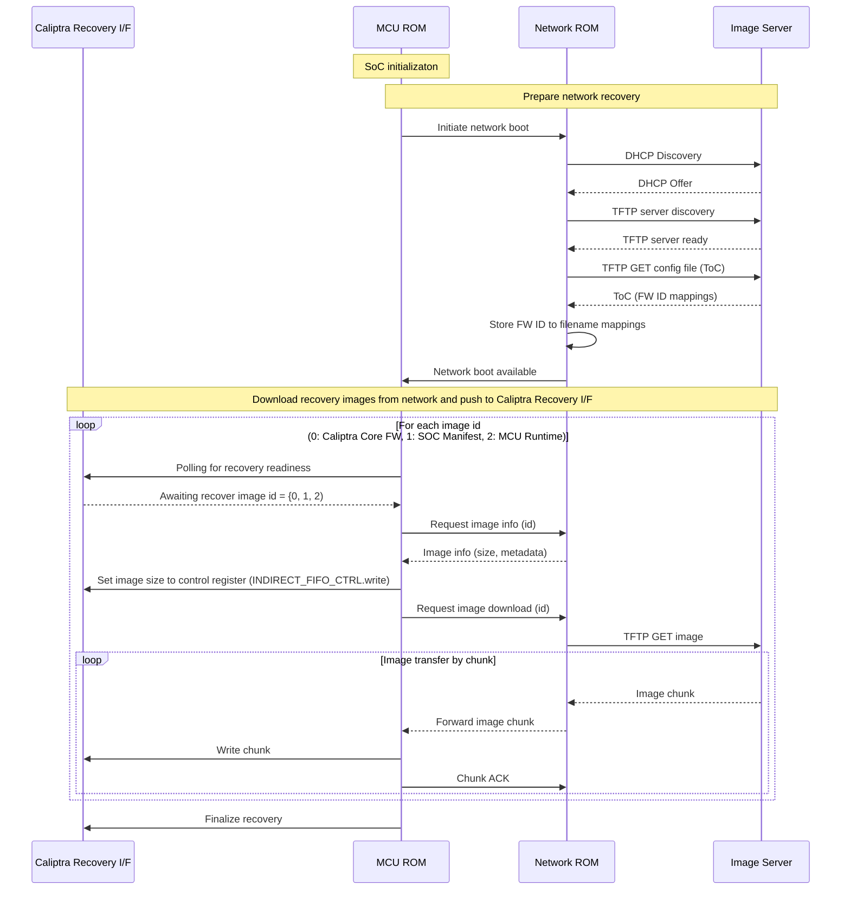

# Caliptra Network Boot Utility - Design Document

## Overview

This document outlines the design for a lightweight network boot utility for the Caliptra subsystem, similar to PXE boot functionality. The system enables the Caliptra SS to download firmware images over the network through a dedicated Network Boot ROM within a ROM environment.

The Network Boot ROM acts as an intermediary between remote image servers and the Caliptra SS, handling network communications including DHCP configuration, TFTP server discovery, and firmware image downloads. The system supports downloading multiple firmware components including Caliptra FMC+RT images, SoC manifests, and MCU runtime images through a firmware ID-based mapping system.

## System Architecture



## System Boot Process Flow

The following diagram illustrates the high-level flow of the network boot process from initialization to image delivery:



## Protocol Support

The Network Boot ROM supports a minimal set of protocols optimized for the Caliptra ROM environment:

### DHCP (Dynamic Host Configuration Protocol)
- **Purpose**: Automatic network configuration
- **Advantages**:
  - Standard network configuration protocol
  - Minimal overhead for basic IP assignment
  - Simple UDP-based protocol
- **Implementation**: Client-side DHCP for IP address, gateway, and boot server discovery

### TFTP (Trivial File Transfer Protocol)
- **Purpose**: Lightweight file transfer for firmware images
- **Advantages**:
  - Extremely lightweight - minimal overhead perfect for ROM environments
  - Simple UDP-based protocol - easy to implement securely
  - Small code footprint (~5-10KB implementation)
  - Standard protocol for network boot scenarios
- **Implementation**: Client-side TFTP for firmware image download

## Network Boot ROM Interface Design

The Network Boot ROM provides a simple interface for the Caliptra SS to request firmware images over the network.

### Core Functions

The Network Boot ROM implements the following core functions:

#### Network Discovery
- **DHCP Configuration**: Automatically configure network interface using DHCP
- **Server Discovery**: Identify TFTP server for firmware image downloads
- **Configuration Download**: Download firmware ID to filename mapping configuration
- **Mapping Storage**: Store firmware ID mappings for subsequent image requests

#### Image Transfer
- **Firmware ID Resolution**: Map firmware IDs to actual filenames using stored configuration
- **TFTP Download**: Download firmware images from TFTP server using resolved filenames
- **Data Streaming**: Stream image data directly to Caliptra SS

#### Supported Firmware IDs
- **ID 0**: Caliptra FMC+RT image
- **ID 1**: SoC Manifest
- **ID 2**: MCU RT image

### Network Boot ROM Interface

```rust
/// Network Boot ROM interface for Caliptra SS
pub trait NetworkBootCoprocessor {
    type Error;

    /// Start network boot discovery process
    /// This will perform DHCP, discover TFTP server, and download configuration
    fn start_network_boot_discovery(&mut self) -> Result<NetworkBootStatus, Self::Error>;

    /// Download firmware image by ID
    fn download_image(&mut self, firmware_id: FirmwareId) -> Result<ImageStream, Self::Error>;

    /// Get network status and configuration
    fn get_network_status(&self) -> Result<NetworkStatus, Self::Error>;
}

/// Firmware ID enumeration
#[derive(Debug, Clone, Copy)]
pub enum FirmwareId {
    /// Caliptra FMC+RT image
    CaliptraFmcRt = 0,
    /// SoC Manifest
    SocManifest = 1,
    /// MCU RT image
    McuRt = 2,
}

/// Network boot discovery status
#[derive(Debug)]
pub struct NetworkBootStatus {
    pub network_ready: bool,
    pub tftp_server_discovered: bool,
    pub config_downloaded: bool,
    pub firmware_mappings: FirmwareMappings,
}

/// Firmware ID to filename mappings
#[derive(Debug, Clone)]
pub struct FirmwareMappings {
    pub caliptra_fmc_rt: String,
    pub soc_manifest: String,
    pub mcu_rt: String,
}

/// Network configuration structure
#[derive(Debug, Clone)]
pub struct NetworkConfig {
    pub ip_address: IpAddr,
    pub netmask: IpAddr,
    pub gateway: Option<IpAddr>,
    pub tftp_server: IpAddr,
}

/// Network status information
#[derive(Debug)]
pub struct NetworkStatus {
    pub connected: bool,
    pub config: Option<NetworkConfig>,
    pub server_reachable: bool,
}

/// Streaming interface for image data
pub trait ImageStream {
    /// Read next chunk of image data
    fn read_chunk(&mut self, buffer: &mut [u8]) -> Result<usize, Error>;

    /// Get total image size if known
    fn total_size(&self) -> Option<u64>;

    /// Check if stream is complete
    fn is_complete(&self) -> bool;
}
```

### Usage Example

```rust
// Example: Caliptra SS network boot process
fn perform_network_boot(&mut self) -> Result<(), Error> {
    // 1. Start network boot discovery
    let boot_status = self.network_boot.start_network_boot_discovery()?;

    if !boot_status.network_ready || !boot_status.config_downloaded {
        return Err(Error::NetworkBootNotAvailable);
    }

    // 2. Download Caliptra FMC+RT image
    let mut caliptra_stream = self.network_boot.download_image(FirmwareId::CaliptraFmcRt)?;
    self.load_image_stream(caliptra_stream, ImageDestination::CaliptraCore)?;

    // 3. Download SoC Manifest
    let mut manifest_stream = self.network_boot.download_image(FirmwareId::SocManifest)?;
    self.load_image_stream(manifest_stream, ImageDestination::SocManifest)?;

    // 4. Download MCU RT image
    let mut mcu_stream = self.network_boot.download_image(FirmwareId::McuRt)?;
    self.load_image_stream(mcu_stream, ImageDestination::McuRuntime)?;

    // 5. Validate and boot all images
    self.validate_and_boot_images()?;

    Ok(())
}

fn load_image_stream(&mut self, mut stream: ImageStream, dest: ImageDestination) -> Result<(), Error> {
    let mut buffer = [0u8; 4096];
    while !stream.is_complete() {
        let bytes_read = stream.read_chunk(&mut buffer)?;
        if bytes_read > 0 {
            self.write_image_chunk(dest, &buffer[..bytes_read])?;
        }
    }
    Ok(())
}
```

### Configuration File Format

The Network Boot ROM downloads a configuration file that maps firmware IDs to filenames:

```json
{
    "firmware_mappings": {
        "0": "caliptra-fmc-rt-v1.2.3.bin",
        "1": "soc-manifest-v2.1.0.bin",
        "2": "mcu-runtime-v3.0.1.bin"
    }
}
```

## Network Stack Implementation

For the Network Boot ROM implementation, we need a minimal network stack that supports DHCP and TFTP while meeting the constraints of a ROM environment.

### Option 1: lwIP (Lightweight IP) with Rust Bindings

**Repository**: https://git.savannah.nongnu.org/cgit/lwip.git (upstream C)
**Rust Bindings**: https://github.com/embassy-rs/lwip (Embassy lwIP bindings)

**Description**: Mature, lightweight TCP/IP stack originally written in C with Rust FFI bindings.

**Advantages**:
- ✅ **Built-in DHCP and TFTP Support**: Native support for required protocols
- ✅ **Mature and Battle-Tested**: Currently used by u-boot and other embedded systems
- ✅ **Minimal Configuration**: Can be configured for UDP-only operation

**Disadvantages**:
- ❌ **C Language Security Risks**: Inherits buffer overflow and memory safety vulnerabilities from C
- ❌ **FFI Complexity**: Rust-C interop adds complexity and potential for safety violations

**Required Protocol Support**:
- ✅ DHCP client
- ✅ TFTP client
- ✅ UDP sockets

### Option 2: smoltcp + Custom TFTP

**Core**: https://github.com/smoltcp-rs/smoltcp (0BSD License)
**TFTP**: Custom implementation on UDP

**Description**: Pure Rust network stack with custom TFTP implementation for minimal footprint.

**Advantages**:
- ✅ **Memory Safety**: Pure Rust eliminates entire classes of security vulnerabilities
- ✅ **ROM Optimized**: Minimal footprint with only required features included
- ✅ **Modular Design**: Include only DHCP and TFTP to minimize code size
- ✅ **No FFI Overhead**: Native Rust performance without C interop costs
- ✅ **Strong Type Safety**: Compile-time prevention of many networking bugs
- ✅ **Excellent Licensing**: 0BSD license is very permissive

**Disadvantages**:
- ❌ **Custom TFTP Implementation**: Must implement TFTP protocol from scratch
- ❌ **Less Battle-Tested**: Newer ecosystem compared to lwIP

**Required Protocol Support**:
- ✅ UDP sockets (smoltcp)
- ✅ DHCP client (smoltcp)
- ⚠️ TFTP (custom implementation required)

### Recommended Approach

**For Production Caliptra System**: **smoltcp + Custom TFTP**

**Rationale**:
- **Security First**: Memory safety is critical for Root of Trust systems
- **ROM Constraints**: Minimal footprint with only DHCP and TFTP support
- **Simplicity**: Reduced complexity with only essential protocols
- **Control**: Custom TFTP implementation allows Caliptra-specific optimizations

**Implementation Strategy**:
1. **Phase 1**: Implement core UDP networking with smoltcp
2. **Phase 2**: Add DHCP client functionality
3. **Phase 3**: Implement lightweight TFTP client for firmware downloads

**Protocol Implementation Order**:
1. **UDP Sockets**: Foundation for all network communication
2. **DHCP Client**: Automatic network configuration
3. **TFTP Client**: Firmware image download capability

---

## MCU ROM <--> Network ROM Messaging Protocol
The messaging protocol between the MCU ROM and Network Boot ROM is designed to be transport agnostic, enabling flexible integration over various interconnects such as MMIO, mailbox, or shared memory. Messages are exchanged in a request-response pattern, with well-defined fields and status codes, allowing reliable coordination of network boot operations regardless of the underlying transport mechanism. This abstraction ensures compatibility with diverse hardware platforms and simplifies protocol implementation.


| Message Name                   | Direction (MCU ROM → Network ROM) | Fields Sent by MCU ROM                | Purpose / Expected Response                |
|------------------------------- |-----------------------------------|---------------------------------------|--------------------------------------------|
| Network Boot Discovery Request | MCU ROM → Network ROM             | —                                     | Initiate network boot; triggers network setup and config download. Response: Network Boot Discovery Status. |
| Image Info Request             | MCU ROM → Network ROM             | firmware_id                           | Request image metadata (size, version, etc.) for given firmware ID. Response: Image Info Response. |
| Image Download Request         | MCU ROM → Network ROM             | firmware_id                           | Request download of image for given firmware ID. Response: Image Chunk stream. |
| Chunk ACK                      | MCU ROM → Network ROM             | firmware_id, offset                   | Acknowledge receipt of image chunk; allows next chunk to be sent. No explicit response. |
| Boot Complete / Error          | MCU ROM → Network ROM             | status (Success/Error), error_code    | Notify completion or error in boot process. No explicit response. |
