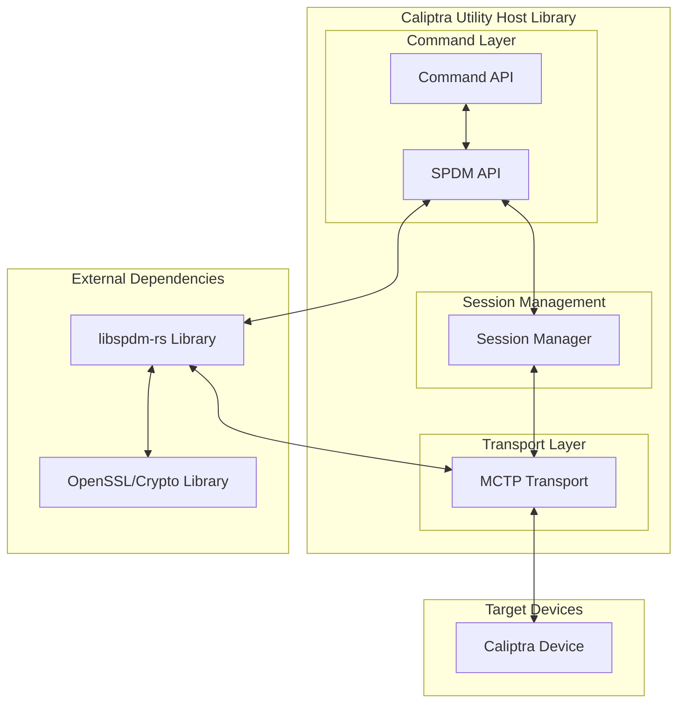

# Caliptra Utility Host Library and libSPDM integration

https://github.com/ccc-spdm-tools/spdm-rs


## Architecture Overview



## Component Design

### 1. SPDM Rust API Layer

#### Core SPDM API Functions
Following the `device_info.rs` pattern with `caliptra_cmd_*` functions:

```rust
use caliptra_util_host_session::CaliptraSession;
use caliptra_util_host_transport::TransportError;

// SPDM Version negotiation
pub fn caliptra_cmd_spdm_get_version(
    session: &mut CaliptraSession,
) -> Result<SpdmVersion, TransportError> {
    // Implementation using libspdm wrapper
}

// SPDM Capabilities exchange  
pub fn caliptra_cmd_spdm_get_capabilities(
    session: &mut CaliptraSession,
) -> Result<SpdmCapabilities, TransportError> {
    // Implementation using libspdm wrapper
}

// SPDM Algorithm negotiation
pub fn caliptra_cmd_spdm_negotiate_algorithms(
    session: &mut CaliptraSession,
    req_base_asym_algo: u16,
    req_base_hash_algo: u32,
) -> Result<SpdmAlgorithms, TransportError> {
    // Implementation using libspdm wrapper
}

// SPDM Certificate digests
pub fn caliptra_cmd_spdm_get_digests(
    session: &mut CaliptraSession,
) -> Result<Vec<SpdmDigest>, TransportError> {
    // Implementation using libspdm wrapper
}

// SPDM Certificate chain
pub fn caliptra_cmd_spdm_get_certificate(
    session: &mut CaliptraSession,
    slot_id: u8,
    offset: u16,
    length: u16,
) -> Result<SpdmCertificateChain, TransportError> {
    // Implementation using libspdm wrapper
}

// SPDM Challenge-Response authentication
pub fn caliptra_cmd_spdm_challenge(
    session: &mut CaliptraSession,
    slot_id: u8,
    measurement_summary_hash_type: u8,
    nonce: [u8; 32],
) -> Result<SpdmChallengeAuth, TransportError> {
    // Implementation using libspdm wrapper
}

// SPDM Measurements
pub fn caliptra_cmd_spdm_get_measurements(
    session: &mut CaliptraSession,
    slot_id: u8,
    measurement_operation: u8,
    nonce: Option<[u8; 32]>,
) -> Result<SpdmMeasurements, TransportError> {
    // Implementation using libspdm wrapper
}

// SPDM Key Exchange
pub fn caliptra_cmd_spdm_key_exchange(
    session: &mut CaliptraSession,
    measurement_summary_hash_type: u8,
    slot_id: u8,
    dhe_named_group: u16,
    opaque_data: &[u8],
) -> Result<SpdmKeyExchangeResponse, TransportError> {
    // Implementation using libspdm wrapper
}

// SPDM Finish (complete session establishment)
pub fn caliptra_cmd_spdm_finish(
    session: &mut CaliptraSession,
    session_id: u32,
    req_slot_id: u8,
    signature: &[u8],
) -> Result<SpdmFinishResponse, TransportError> {
    // Implementation using libspdm wrapper
}

// SPDM Secure message send
pub fn caliptra_cmd_spdm_send_secure_message(
    session: &mut CaliptraSession,
    session_id: u32,
    app_message: &[u8],
) -> Result<Vec<u8>, TransportError> {
    // Implementation using libspdm wrapper for secure session communication
}
```

#### SPDM API Interface
Following the template format from `caliptra-util-host/commands/src/api/device_info.rs`:

```rust
pub trait SpdmCommand {
    type Request: SpdmMessage;
    type Response: SpdmMessage;
    
    fn execute(&self, client: &mut SpdmClient) -> Result<Self::Response, SpdmError>;
}

// SPDM API implementations following device_info.rs pattern
pub struct GetVersionCommand;
pub struct GetCapabilitiesCommand;
pub struct NegotiateAlgorithmsCommand;
pub struct GetDigestsCommand;
pub struct GetCertificateCommand { slot_id: u8 }
pub struct ChallengeCommand { slot_id: u8, nonce: [u8; 32] }
pub struct GetMeasurementsCommand { slot_id: u8, operation: MeasurementOperation }
pub struct KeyExchangeCommand { dhe_named_group: u16, opaque_data: Vec<u8> }
```
### 2. Transport Layer Integration

#### SPDM Transport Trait
```rust
pub trait SpdmTransport: Send + Sync {
    fn send_message(&mut self, message: &[u8]) -> Result<(), TransportError>;
    fn receive_message(&mut self, buffer: &mut [u8]) -> Result<usize, TransportError>;
    fn get_max_message_size(&self) -> usize;
}
```

#### MCTP Transport Implementation
```rust
pub struct MctpTransport {
    endpoint_id: u8,
    message_tag: u8,
    socket: UdpSocket,
    buffer: Vec<u8>,
}

impl MctpTransport {
    pub fn new(endpoint_id: u8, remote_addr: SocketAddr) -> Result<Self, TransportError>;
    
    fn fragment_message(&self, message: &[u8]) -> Vec<MctpPacket>;
    fn reassemble_message(&mut self, packets: &[MctpPacket]) -> Result<Vec<u8>, TransportError>;
}

impl SpdmTransport for MctpTransport {
    fn send_message(&mut self, message: &[u8]) -> Result<(), TransportError> {
        let packets = self.fragment_message(message);
        for packet in packets {
            let mctp_frame = packet.to_wire_format()?;
            self.socket.send(&mctp_frame)?;
        }
        Ok(())
    }
    
    fn receive_message(&mut self, buffer: &mut [u8]) -> Result<usize, TransportError> {
        // Implement MCTP packet reassembly
        // Handle fragmentation and sequencing
        // Return reassembled SPDM message
    }
}
```